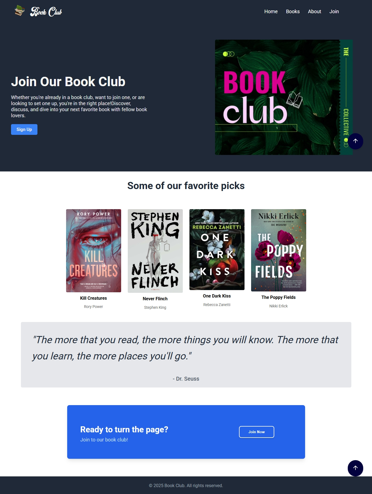

# 📚 Book Club Landing Page

Welcome to the **Book Club** website — a responsive and elegant landing page built with **HTML** and **CSS** only.

This project is inspired by a modern layout design and serves as a digital presence for a book club community. The site is beginner-friendly, lightweight, and mobile responsive.

---

## 📸 Screenshots 

)
## 🔍 Features

- Responsive design for all screen sizes
- Clear call-to-action (Join button)
- About section explaining the club's mission
- Books page for displaying featured reads
- Contact information included
- Clean layout using Flexbox

---

## 📁 Pages Included

| Page       | Description                          |
|------------|--------------------------------------|
| `index.html` | Main landing page with hero section |
| `books.html` | Page with sample featured books     |
| `about.html` | About us and mission of the club    |
| `join.html`  | Sign-up or registration page        |

---

## 💻 Technologies Used

- HTML5
- CSS3 (Flexbox)
- Mobile-first responsive design

---

